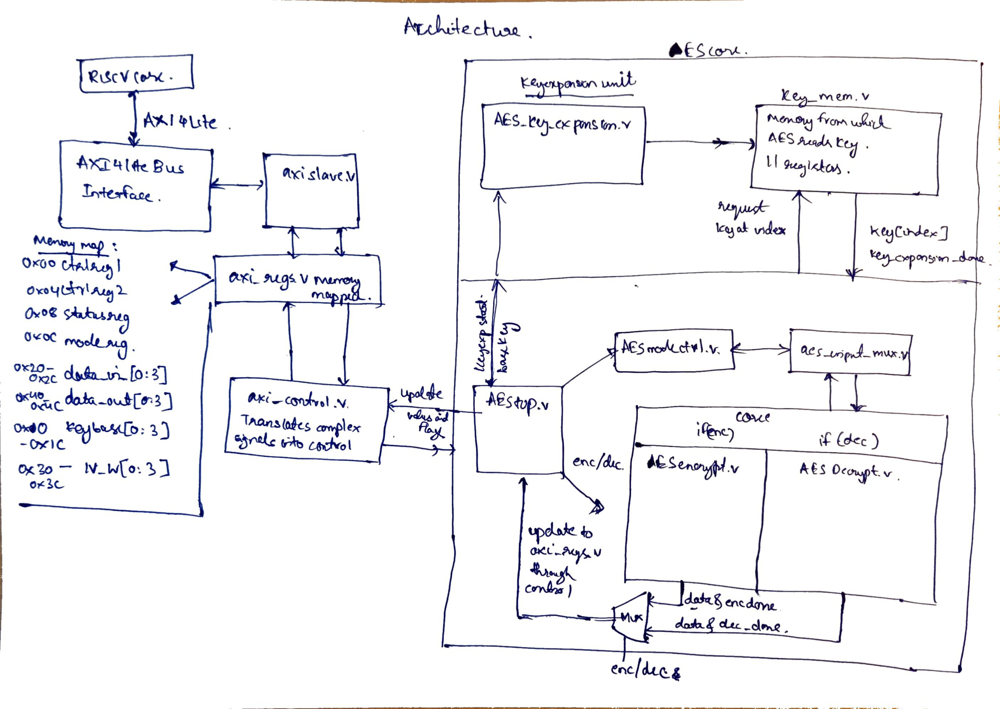

# AES Hardware Accelerator with AXI4-Lite Interface

## 1. Project Overview

This project implements a **modular AES hardware accelerator** designed for integration into modern SoC platforms using a **memory-mapped AXI4-Lite interface**. The accelerator supports multiple AES modes of operation and is architected to cleanly separate:

- AXI protocol handling
- Register and control logic
- Mode-specific datapath logic
- Cryptographic datapath (encryption/decryption)
- Key expansion

The design follows **industry-standard IP development practices**, emphasizing:
- Clear firmware–hardware boundaries
- Deterministic control sequencing
- Replaceable cryptographic cores
- Scalability for future performance and feature enhancements

---

## 2. High-Level Architecture
```
        +----------------------+
        |   CPU / Firmware     |
        | (ARM / RISC-V Core)  |
        +----------+-----------+
                   |
                   | AXI4-Lite
                   v
        +----------------------+
        |     axi_slave        |
        |  (AXI protocol FSM)  |
        +----------+-----------+
                   |
                   | wr_en / rd_en
                   v
        +----------------------+
        |      axi_regs        |
        | (Register File)      |
        +----------+-----------+
                   |
                   | control + data
                   v
        +----------------------+
        |    axi_control       |
        | (Control FSM)        |
        +----------+-----------+
                   |
                   | start / mode / enc_dec / data
                   v
        +----------------------+
        |   aes_top            |
        | (AES Wrapper)        |
        +----------+-----------+
                   |
                   v
+---------------------------------------------+
|            AES Mode & Datapath               |
|                                              |
|  +------------------+   +----------------+   |
|  | aes_mode_ctrl    |-->| feedback_reg   |   |
|  +------------------+   +----------------+   |
|           |                       |          |
|           |                       v          |
|           |                 +-----------+    |
|           |                 | ctr_reg   |    |
|           v                 +-----------+    |
|    +----------------+                        |
|    | aes_input_mux  |----------------------->|
|    +----------------+                        |
|                   +---------------------+    |
|                   | AES Encrypt/Decrypt |    |
|                   |     Core            |    |
|                   +---------------------+    |
+---------------------------------------------+

```



The system is divided into **clearly defined layers**, each with a single responsibility.

---

## 3. Directory Structure
```
aes_accelerator/
├── rtl/
│   ├── axi/
│   │   ├── axi_slave.v
│   │   ├── axi_regs.v
│   │   ├── axi_control.v
│   │
│   ├── common/
│   │   ├── aes_mode_controller.v
│   │   ├── aes_input_mux.v
│   │   ├── feedback_reg_128.v
│   │   ├── ctr_reg_128.v
│   │   ├── xor_128.v
│   │
│   ├── keyexp/
│   │   ├── Aes_Key_Expansion.v
│   │   ├── current_word_gen_128.v
│   │   ├── key_mem.v
│   │
│   ├── encrypt/
│   │   ├── aes_encrypt.v
│   │   ├── subbytes.v
│   │   ├── shiftrows.v
│   │   ├── mixcolumns.v
│   │   └── addroundkey.v
│   │
│   ├── decrypt/
│   │   ├── aes_decrypt.v
│   │   ├── inv_subbytes.v
│   │   ├── inv_shiftrows.v
│   │   └── inv_mixcolumns.v
│   │   └── addroundkey.v
│   │
│   └── top/
│       ├── aes_top.v
│       └── aes_axi_top.v
│
├── tb/
│   ├── tb_axi.v
│   ├── tb_keyexp.v
│   ├── tb_encrypt.v
│   ├── tb_modes.v
│   └── tb_aes_axi.v
│
└── firmware/
    ├── aes_regs.h
    ├── aes_driver.h
    └── aes_driver.c
```
---

## 4. AXI Subsystem Overview

The AXI subsystem is responsible for exposing the accelerator as a **memory-mapped peripheral**. It is split into three modules:

| Module | Responsibility |
|------|---------------|
| `axi_slave` | AXI4-Lite protocol handling |
| `axi_regs` | Register map and storage |
| `axi_control` | Control FSM and sequencing |

No AES datapath logic exists in the AXI layer.

---

## 5. AXI4-Lite Interface Characteristics

- 32-bit data bus
- Single-beat read/write transactions
- No burst support
- In-order responses
- Active-low reset (`resetn`)

The interface is compatible with:
- ARM AXI interconnects
- RISC-V SoCs using AXI (RocketChip, LiteX, etc.)

---

## 6. AXI Register Map

All registers are **32-bit word-aligned**. Addresses are shown as **byte offsets** from the base address.

| Offset | Register | Access | Description |
|------|---------|--------|------------|
| `0x00` | `CTRL_REG1` | R/W | Control: START, ENC/DEC |
| `0x04` | `CTRL_REG2` | R/W | Reserved for future use |
| `0x08` | `STATUS` | R | BUSY, DONE |
| `0x0C` | `MODE` | R/W | AES mode selection |
| `0x10–0x1C` | `BASE_KEY[0..3]` | W | Initial AES key |
| `0x20–0x2C` | `DATA_IN[0..3]` | W | Input data block |
| `0x30–0x3C` | `IV[0..3]` | W | Initialization Vector |
| `0x40–0x4C` | `DATA_OUT[0..3]` | R | Output data block |

### Control Register (`CTRL_REG1`)
| Bit | Name | Description |
|----|----|-------------|
| 0 | START | Rising edge starts AES operation |
| 1 | ENC_DEC | 0 = Encrypt, 1 = Decrypt |

### Status Register (`STATUS`)
| Bit | Name | Description |
|----|----|-------------|
| 0 | BUSY | AES operation in progress |
| 1 | DONE | Operation complete |

---

## 7. AXI Control FSM

The control FSM resides in `axi_control.v` and sequences accelerator operation.

### FSM States

| State | Meaning |
|----|--------|
| IDLE | Waiting for START |
| RUN | AES block processing |
| DONE | Output valid |

### Key Properties

- `START` is **edge-detected**
- `aes_start` is a **single-cycle pulse**
- No re-triggering while BUSY
- Firmware must clear and re-assert START
- Status bits are stable and race-free

---

## 8. AES Accelerator Core Architecture

The AES core is split into **mode logic** and **cryptographic primitive**.

### 8.1 Mode Logic (`common/`)

Mode handling is implemented externally to the AES core using:

- `aes_mode_controller`
- `feedback_reg_128`
- `ctr_reg_128`
- `aes_input_mux`

Supported modes:
- ECB
- CBC
- CFB
- OFB
- CTR

The AES core itself is **mode-agnostic**.

---

### 8.2 Mode Controller (`aes_mode_controller.v`)

Responsibilities:
- Load IV on START
- Update feedback after block completion
- Increment counter for CTR mode
- Generate mode-specific control signals

The controller is **independent of encrypt/decrypt selection**, which is handled in the datapath.

---

### 8.3 Feedback Register

The feedback register:
- Stores previous ciphertext or AES output
- Supports IV loading
- Updates only when commanded by the mode controller

This enables correct chaining behavior in CBC, CFB, and OFB modes.

---

### 8.4 Counter Register

The counter register:
- Loads IV as initial counter value
- Increments once per completed block
- Used exclusively in CTR mode

---

### 8.5 AES Input Mux

Selects the AES input based on mode:

| Mode | AES Input |
|----|----------|
| ECB | Plaintext |
| CBC | Plaintext ⊕ Feedback |
| CFB | Feedback |
| OFB | Feedback |
| CTR | Counter |

---


## 9. AES Core (`aes_top.v`)

This module:
- Integrates mode logic and AES core
- Connects feedback and counter registers
- Acts as the boundary between control and cryptography

Inputs:
- `start`, `enc_dec`, `mode`
- `plaintext`, `iv`

Outputs:
- `result`
- `done`

---

## 10. Reset Strategy

| Domain | Signal | Polarity |
|-----|-------|----------|
| AXI / Control | `resetn` | Active-low |
| AES Datapath | `reset` | Active-high |

Reset polarity is converted at the AXI–AES boundary to maintain clarity and reuse.

---
## 11. Signal Ownership


| Signal        | Driven By           | Used By             |
| ------------- | ------------------- | ------------------- |
| `wr_en/rd_en` | axi_slave           | axi_regs            |
| `ctrl_reg`    | axi_regs            | axi_control         |
| `aes_start`   | axi_control         | aes_encrypt_top     |
| `mode_lat`    | axi_control         | aes_mode_controller |
| `fb_update`   | aes_mode_controller | feedback_reg        |
| `ctr_inc`     | aes_mode_controller | ctr_reg             |
| `done`        | AES core            | axi_control         |


## 12. Firmware Programming Model

Typical firmware sequence:

1. Write key registers
2. Write IV (if required)
3. Write input data
4. Write MODE
5. Write CTRL_REG1.START
6. Poll STATUS.DONE
7. Read DATA_OUT

Once START is issued, the accelerator operates autonomously.

---


## 13. Summary

This project delivers a **cleanly architected AES accelerator IP** with:

- A robust AXI4-Lite interface
- Deterministic control sequencing
- Modular mode handling
- Replaceable cryptographic core

The design is suitable for **FPGA prototyping**, **academic research**, and **industrial SoC integration**.

---

